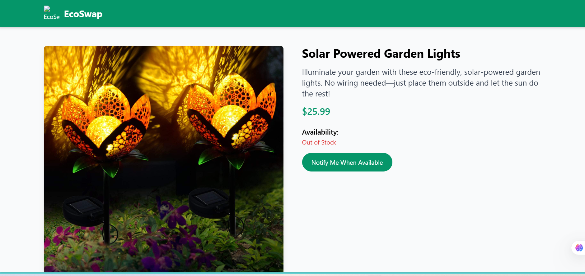
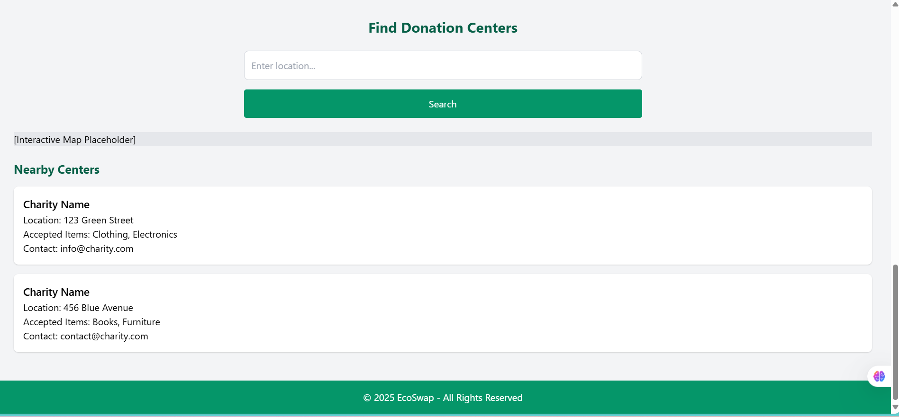
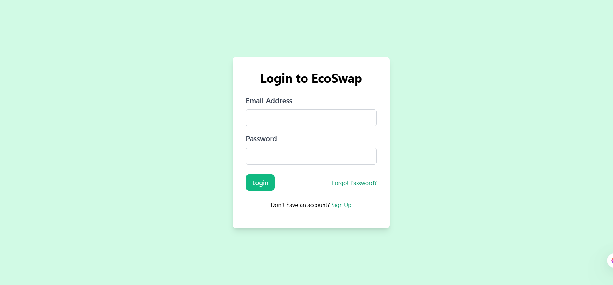
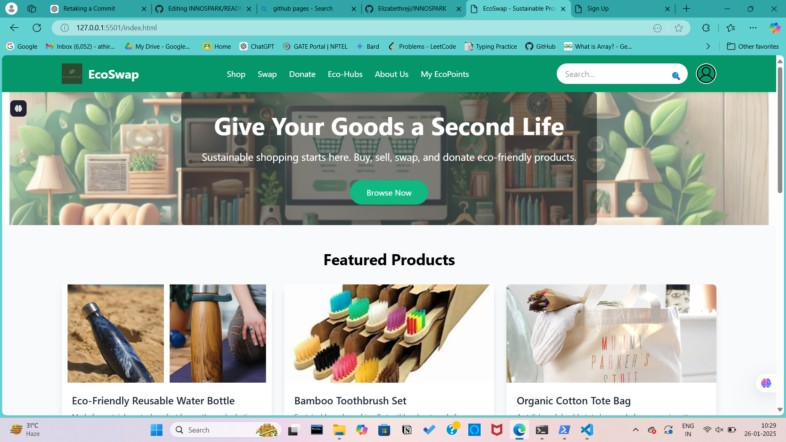

# ECOSWAP 🎯

##Sustainable Product Marketplace Project Plan
### Team Name:InnoSpark

### Team Members
- Member 1: Elizabeth Reji- LBS Institute Of Technology for Women Poojappura Thiruvananthapuram
- Member 2: Athira K- LBS Institute Of Technology for Women Poojappura Thiruvananthapuram

### Hosted Project Link
[mention your project hosted project link here]

### Project Description
EcoSwap is a sustainable product marketplace for buying, selling, swapping, or donating eco-friendly and second-hand items. It focuses on sustainability with features like an Eco-Footprint Tracker, gamified rewards (EcoPoints), AI-powered product matching, and a community-driven ecosystem. The platform includes an EcoHub for sustainable ecology enthusiasts to connect and an AI bot for providing sustainable education.

### The Problem statement
The growing need for a platform where individuals can easily and securely exchange items or services in an environmentally conscious way. Many people struggle to find a reliable and sustainable way to swap goods, and EcoSwap addresses this by providing a simple, user-friendly system for connecting like-minded individuals. It also ensures data security and efficient management of user information, promoting a circular economy and reducing waste.

### The Solution

### Solutions

1. **User Registration & Profile Setup**  
   Users can easily create accounts and set up personalized profiles to track their sustainability goals. This feature enables them to tailor their experience on the platform to align with their eco-friendly values.

2. **Marketplace Features (Buy, Sell, Swap)**  
   The platform offers a marketplace where users can buy eco-friendly products, sell items they no longer need, or swap goods to reduce waste and promote sustainable consumption.

3. **Eco-Footprint Tracker**  
   Our Eco-Footprint Tracker allows users to monitor and visualize their environmental impact based on their purchases, swaps, and other platform activities. It helps users stay mindful of their sustainability efforts.

4. **Gamification (EcoPoints Rewards)**  
   Users earn EcoPoints for taking eco-friendly actions such as buying sustainable products or recycling. These points can be redeemed for rewards like discounts, eco-friendly products, or even donations to environmental causes.

5. **AI-Based Product Matching**  
   Leveraging AI, this feature recommends eco-friendly products based on user preferences, previous activities, and their sustainability goals, enhancing the shopping experience and supporting more mindful purchases.

6. **Community Engagement Features (Forums, Eco-Hubs)**  
   The platform includes discussion forums and Eco-Hubs where users can engage with like-minded individuals, share sustainability tips, collaborate on green initiatives, and create a vibrant community focused on environmental change.

7. **Trust and Transparency (Rating System, Verified Profiles)**  
   To foster a safe and reliable marketplace, the platform includes a rating system that allows users to leave feedback on transactions. Verified profiles help ensure trust and transparency in buying and selling.

8. **Educational Content (Blogs, Tutorials, Videos)**  
   A comprehensive resource hub with blogs, tutorials, and videos helps users learn about sustainable living practices, the benefits of eco-friendly products, and how to reduce their environmental footprint.

9. **Feedback System with EcoPoints Deduction for Sellers**  
   Our feedback system holds sellers accountable by deducting EcoPoints for negative reviews, ensuring that sellers maintain high-quality service and trustworthiness within the community.

## Technical Details
### Technologies/Components Used
For Software:
- HTML/CSS, Javascript
- Express.js,Node.js,Tailwind CSS
- MySQL2 ,Body-Parser
- Postman,Git,VS Code

For Hardware:
### Main Components:
- - **Computer/Server**:  
  The primary hardware for running the EcoSwap platform locally or on a cloud server.
- **Router/Network Equipment**:  
  To facilitate internet connectivity for hosting the platform and database.
- **Storage Device**:  
  Hard drive or SSD to store the website files, database, and backups.
### Specifications:
- **Processor**:  
  - AMD Ryzen 5 3500U or equivalent processor with 4 cores and 8 threads for smooth processing of server-side tasks.
  
- **RAM**:  
  - 8GB DDR4 RAM to ensure smooth execution of the platform's backend and frontend, even with multiple users.
  
- **Storage**:  
  - 512GB SSD for faster data retrieval, storage, and backup processes. SSD offers quicker read/write speeds than traditional HDD.
  
- **Network Speed**:  
  - At least 10Mbps upload/download speed for smooth access and hosting of the platform. Higher speeds (20Mbps or more) recommended for better performance during high traffic.

- ### Tools Required:
- **Local Development Environment**:  
  A local machine capable of running server software (such as Node.js).
  
- **Cloud Hosting Platform (optional)**:  
  If deploying remotely, you will need a cloud service like AWS, Heroku, or DigitalOcean for hosting the platform.

- **MySQL Database Server**:  
  Either a local or cloud-based MySQL server to store user and transaction data.
  
- **Development Tools**:  
  - **VS Code**  for coding.
  - **Postman** for API testing and debugging.
  - **Git** for version control.

- **Browser**:  
  A modern web browser (e.g., Chrome, Edge) for testing the platform.

### Implementation
For Software:
# Installation
[commands]

# Run
[commands]

### Project Documentation
For Software:

# Screenshots (Add at least 3)

)
*This is the main page of the website.And from this page it will navigate to another pages *

*This is the page we get when we click on featuring products .Each featured product is displayed independently.*

*This page shows the donation centres near to our location.*

# Diagrams

*Add caption explaining your workflow*

For Hardware:

# Schematic & Circuit

*Add caption explaining connections*

*Add caption explaining the schematic*

# Build Photos

*This is the signup page*

*Login page*

*The main page of the website*

### Project Demo
# Video
[EcoSwap - 26 January 2025.mp4]
*It travells through each page of website*

# Additional Demos
[Add any extra demo materials/links]

## Team Contributions
- [Name 1]: [Specific contributions]
- [Name 2]: [Specific contributions]
- [Name 3]: [Specific contributions]

---
Made with ❤️ at TinkerHub
